# Beneficio Esperado como métrica de decisión

Kaggle es una plataforma en donde se presentan diferentes problemas relacionados al mundo del machine learning, ciencia de datos y análisis predictivo. Una de las secciones más interesantes es el de las competiciones en las cuales los usuarios deben resolver un problema específico y de acuerdo a una métrica de performance se clasifican todas las soluciones propuestas, obviamente gana quien logra el máximo valor o el mínimo según el tipo de métrica. Bueno, al más puro estilo Kaggle resultó ser el trabajo final del curso de Ciencia de Datos y Big Data de la UBA el cual acabo de finalizar y en el que nuestro equipo obtuvo el primer puesto. 

# Introducción

Si fueramos parte de un centro de investigación de machine learning nos interesaría por ejemplo maximizar la exactitud de los modelos de clasificación o minimizar el error cuadrático medio de los modelos de regresión, pero la realidad es que si somos parte de una empresa que busca un beneficio monetario la métrica a la que debemos apuntar es el *beneficio esperado*, es decir debemos poder monetizar las alternativas de soluciones que proponemos y seleccionar aquella que nos de el mayor beneficio. Este fue el enfoque y la clave para resolver el proyecto que nos presentaron y que pasaremos a explicar a continuación.

# Presentación del Problema

El problema propuesto consistía en analizar datos reales de campañas de marketing llevadas a cabo por un banco en periodos pasados destinadas a la venta de un producto bancario, especificamente de plazos fijos. Dentro de estos datos teníamos información personal de los clientes y datos socioeconómicos del momento en que se realizó la campaña. El objetivo consistía en crear un modelo de machine learning que dada las características de un cliente pueda predecir si este compra o no el producto y de esta manera poder comunicarse para ofrecércelo o bien no gastar recursos en intentarlo. Era un clasico problema de clasificación binaria de aprendizaje supervisado ya que dentro de los datos estaba presente la variable objetivo (compra/no compra). Pero para hacerlo orientado a un problema empresarial se incorporó una matriz de costo/beneficio en el que se especificaba el costo monetario por llamar a un cliente y el beneficio obtenido por vender el producto. Así el mejor modelo predictivo era el que maximizaba el beneficio esperado de una nueva campaña de marketing representado por un grupo de datos que se habían dejado aparte y sobre el cual se evaluaban las soluciones propuestas de todos los equipos pero no se sabía hasta el final ya que ninguno de los equipos tenía acceso a este grupo de datos.

## Descripción del Dataset

Los datos correspondían a contactos con clientes realizados entre mayo de 2008 y junio de 2013 y totalizando 35.010 registros. Este era el dataset utilizado para entrenar y testear el modelo predictivo. Otro dataset con 6178 registros se utilizaría luego de la entrega final para evaluar el mejor modelo propuesto.

Ambos dataset tenían la misma estructura, los atributos con los que contaban  eran los siguientes.

**Variables Predictoras:**

a)	Datos del cliente del banco:
   
   1. `Edad`: edad de los clientes (numérica).
   2. `Trabajo`: tipo de trabajo (categórico: 'obrero', 'gerente', 'administrativo', 'autónomo', 'servicios',  'técnico', 'desempleado', 'empresario', 'jubilado', 'ama de casa', 'desconocido', 'estudiante')
   3. `Estado civil`: (categórico: 'casado', 'divorciado', 'soltero', 'desconocido').
   4. `Educacion`: (categórico: 'basica.9y', 'basica.6y', 'basica.4y', 'secundario', 'universitario', 'desconocido', 'curso profesional', 'sin estudios').
   5. `Default`: indicaba si el cliente tenía crédito en default. (categórico: "si","no","desconocido")
   6. `Prestamo vivienda`: indicaba si el cliente tenía una préstamo de vivienda (categórico: "si", "no","desconocido").
   7. `Prestamo personal`: indicaba si el cliente tenía una préstamo personal (categórico: "si", "no","desconocido").

b)	Relacionado con el contacto de la última campaña:

   8. `Contacto`: tipo de comunicación de contacto (categórico: "celular", "telefono").
   9. `Mes`: mes del último  contacto (categórico: "ene", "feb", "mar", ..., "nov", "dec")
   10. `Dia de la semana`: día de la semana del último  contacto (categórico: "lun", "mar", "mie", "jue", "vie")

c)	Otros atributos:

  11. `Cantidad de contactos`: número de contactos realizados al cliente durante la campaña actual (numérico).
  12. `Dias`: número de días que pasaron desde la campaña anterior a la actual(numérico; 999 significa que el cliente no fue contactado previamente).
  13. `Anterior`: número de contactos realizados al cliente antes de esta campaña (numérico).
  14. `Resultado anterior`: resultado de la campaña de marketing anterior (categórico: 'inexistente', 'fallida', 'exitosa')

d)	Atributos relacionados al contexto social y económico.

  15. `emp.var.rate`: tasa de variación del empleo - indicador trimestral (numérico).
  16. `cons.price.idx`: índice de precios al consumidor - indicador mensual (numérico).
  17. `cons.conf.idx`: índice de confianza del consumidor - indicador mensual (numérico).
  18. `euribor3m`: tasa de interés interbancario a 3 meses (acrónimo de Euro Interbank Offered Rate)- indicador diario (numérico).
  19. `nr.empleados`: promedio trimestral del número de ciudadanos activos (numérico).

e)	Variable de salida (objetivo):
  20. `y`:  indicaba si el cliente había comprado o no el producto (binario: "si", "no")


Una observación importante es que todos los valores nulos fueron reemplazados por la categoría *desconocido*. 

# Carga de Librerías y Configuraciones


```python
# Manipulación de Datos
# =====================
import numpy  as np
import pandas as pd

# Gráficos
# ========
import seaborn           as sns
import matplotlib.pyplot as plt
import squarify          as sq
mypallete = ['orange', 'green']
sns.set_palette(mypallete)
sns.set_style("white")
sns.set_context('notebook')

# Preprocesado, modelado, metricas
# ================================
from sklearn.compose         import ColumnTransformer
from sklearn.preprocessing   import OneHotEncoder
from sklearn.model_selection import train_test_split
from sklearn.model_selection import GridSearchCV
from sklearn.tree            import DecisionTreeClassifier
from sklearn.metrics         import plot_confusion_matrix
from sklearn.metrics         import confusion_matrix
from sklearn.metrics         import accuracy_score
from sklearn.metrics         import precision_score
from sklearn.metrics         import make_scorer
from sklearn.metrics         import classification_report
from sklearn.ensemble        import RandomForestClassifier


# Configuración de warnings
# =========================
import warnings
warnings.filterwarnings('ignore')
```

# Carga, Descripción y Resumen del Dataset


```python
clientes = pd.read_csv('bank.csv')
clientes.info()
```

    <class 'pandas.core.frame.DataFrame'>
    RangeIndex: 35010 entries, 0 to 35009
    Data columns (total 20 columns):
     #   Column                 Non-Null Count  Dtype  
    ---  ------                 --------------  -----  
     0   Edad                   35010 non-null  int64  
     1   Trabajo                35010 non-null  object 
     2   Estado civil           35010 non-null  object 
     3   Educacion              35010 non-null  object 
     4   Default                35010 non-null  object 
     5   Prestamo vivienda      35010 non-null  object 
     6   Prestamo personal      35010 non-null  object 
     7   Contacto               35010 non-null  object 
     8   Mes                    35010 non-null  object 
     9   Dia de la semana       35010 non-null  object 
     10  Cantidad de contactos  35010 non-null  int64  
     11  Dias                   35010 non-null  int64  
     12  Anterior               35010 non-null  int64  
     13  Resultado anterior     35010 non-null  object 
     14  emp.var.rate           35010 non-null  float64
     15  cons.price.idx         35010 non-null  float64
     16  cons.conf.idx          35010 non-null  float64
     17  euribor3m              35010 non-null  float64
     18  nr.employed            35010 non-null  float64
     19  y                      35010 non-null  object 
    dtypes: float64(5), int64(4), object(11)
    memory usage: 5.3+ MB
    


```python
# Valores únicos para cada atributo
for col in clientes.columns:
    print(col)
    print()
    print(clientes[col].unique())
    print('--------------------')
```

    Edad
    
    [34 59 40 32 46 42 24 28 45 30 50 31 60 41 51 53 33 29 78 63 49 38 43 55
     36 52 44 27 37 58 57 25 23 74 54 48 35 39 26 56 83 61 77 62 47 76 22 20
     64 19 21 66 69 88 70 71 72 75 81 73 80 65 68 98 67 92 86 82 18 84 85 79
     91 95 17 89]
    --------------------
    Trabajo
    
    ['Obrero' 'Gerente' 'Administrativo' 'Autonomo' 'Servicios' 'Tecnico'
     'desempleado' 'Empresario' 'Jubilado' 'Ama de casa' 'desconocido'
     'estudiante']
    --------------------
    Estado civil
    
    ['casado' 'divorciado' 'soltero' 'desconocido']
    --------------------
    Educacion
    
    ['basica.9y' 'basica.4y' 'secundario' 'universitario' 'desconocido'
     'basica.6y' 'curso profesional' 'sin estudios']
    --------------------
    Default
    
    ['no' 'desconocido' 'si']
    --------------------
    Prestamo vivienda
    
    ['si' 'desconocido' 'no']
    --------------------
    Prestamo personal
    
    ['no' 'desconocido' 'si']
    --------------------
    Contacto
    
    ['celular' 'telefono']
    --------------------
    Mes
    
    ['may' 'jun' 'ago' 'abr' 'mar' 'nov' 'jul' 'oct' 'dic' 'sep']
    --------------------
    Dia de la semana
    
    ['lun' 'mar' 'mie' 'jue' 'vie']
    --------------------
    Cantidad de contactos
    
    [ 5  6  3 17  2  1 11  8  4 10 12  7 14  9 22 21 35 15 25 23 27 13 29 16
     31 26 30 24 20 28 32 19 34 33 37 18 43 40 39 41 42]
    --------------------
    Dias
    
    [999   3  11   6   9  10  13   1  12   5   4  15  14   7  22   2  27   8
      19   0  17  18  16  25  21  26  20]
    --------------------
    Anterior
    
    [0 1 3 2 4 6 5 7]
    --------------------
    Resultado anterior
    
    ['inexistente' 'fallida' 'exitosa']
    --------------------
    emp.var.rate
    
    [-1.8  1.1  1.4 -0.1 -3.4 -2.9 -1.1 -1.7 -3.  -0.2]
    --------------------
    cons.price.idx
    
    [92.893 93.994 94.465 93.444 93.075 92.843 93.749 93.2   93.918 92.431
     93.369 92.963 94.601 94.027 92.713 92.649 94.215 92.201 94.199 93.798
     92.379 93.876 94.767 92.469 94.055 92.756]
    --------------------
    cons.conf.idx
    
    [-46.2 -36.4 -41.8 -36.1 -47.1 -50.  -34.6 -42.  -42.7 -26.9 -34.8 -40.8
     -49.5 -38.3 -33.  -30.1 -40.3 -31.4 -37.5 -40.4 -29.8 -40.  -50.8 -33.6
     -39.8 -45.9]
    --------------------
    euribor3m
    
    [1.299 4.857 4.961 4.964 4.962 1.405 1.266 1.531 0.645 4.191 4.076 1.334
     4.959 4.957 4.966 1.344 4.96  4.12  0.722 4.859 4.963 0.655 1.327 0.74
     1.291 4.965 1.025 4.86  0.643 1.453 0.895 4.021 4.968 0.993 1.41  4.858
     1.27  0.886 4.865 1.235 4.855 0.706 4.864 0.714 1.262 4.856 0.835 1.281
     4.153 0.905 1.4   0.883 4.955 1.423 1.26  4.967 0.879 1.811 0.987 0.741
     0.869 1.406 1.51  0.644 5.    0.715 1.479 4.97  1.392 0.768 4.866 0.762
     0.684 1.313 1.25  1.099 0.754 1.354 0.646 0.653 1.415 1.035 4.958 0.838
     1.043 0.881 0.896 1.032 0.682 0.797 1.244 1.029 0.654 0.65  1.264 0.72
     4.912 0.739 0.707 0.843 0.7   0.773 1.048 1.483 1.04  1.445 1.365 0.849
     0.683 0.825 0.702 0.652 0.87  0.635 1.466 0.685 4.947 0.959 0.904 0.899
     1.215 0.819 1.435 0.712 0.884 1.268 0.761 1.286 0.803 0.894 1.663 0.672
     1.64  0.728 1.059 1.372 0.723 0.737 1.041 0.851 1.049 0.861 1.629 4.592
     1.028 0.639 0.809 1.252 0.708 0.898 1.072 0.878 0.793 0.651 0.9   0.717
     0.64  3.563 0.788 0.719 0.668 0.942 0.743 0.854 0.882 1.498 4.286 0.699
     0.659 1.085 0.859 0.827 0.977 0.742 1.007 5.045 1.726 0.873 1.538 1.
     1.52  1.259 0.701 3.282 0.893 0.697 1.614 4.343 0.822 0.889 0.642 1.687
     0.744 0.73  0.88  0.709 1.016 0.891 0.735 0.888 1.031 0.778 0.877 0.663
     0.638 0.79  0.982 1.046 1.757 0.829 1.556 0.77  0.781 0.767 0.876 1.384
     0.724 0.649 0.846 0.903 0.71  0.81  0.782 0.821 1.224 0.914 0.834 1.703
     0.733 4.406 0.753 0.972 1.799 0.716 0.634 4.956 0.718 1.65  1.206 1.602
     0.908 0.84  0.688 0.749 1.044 0.727 1.039 0.965 1.018 0.729 4.245 0.755
     0.953 1.03  0.677 0.75  0.927 0.885 0.692 4.918 1.05  1.584 0.766 1.548
     4.794 0.704 1.037 4.827 0.89  1.56  0.636 0.695 0.721 1.778 0.813 0.979
     3.053 0.731 4.223 0.969 4.936 0.771 4.76  0.752 0.732 1.008 0.748 3.743
     4.474 4.7   3.901 0.956 3.329 0.713 0.985 4.921 0.802 0.637 4.663 0.69
     3.669 0.937 4.733 0.921 1.045 3.853 0.711 0.944 1.574 3.428 0.996 3.879
     3.488 3.816]
    --------------------
    nr.employed
    
    [5099.1 5191.  5228.1 5008.7 5195.8 5017.5 5076.2 4963.6 4991.6 5023.5
     5176.3]
    --------------------
    y
    
    ['no' 'si']
    --------------------
    

Antes de proceder al análisis gráfico renombramos algunas columnas y llevamos todos los strings a minúscula separados por guión bajo, todo esto para que los campos y las categorías tengan el mismo formato.


```python
def normalizador(df):
  # Pasamos los nombres de las columnas a minusculas
  df.columns = clientes.columns.str.lower()

  # Renombramos columnas
  df.rename(columns = {'estado civil'         : 'est_civ',
                       'prestamo vivienda'    : 'pres_viv',
                       'prestamo personal'    : 'pres_per',
                       'dia de la semana'     : 'dia_sem',
                       'cantidad de contactos': 'contactos',
                       'resultado anterior'   : 'res_ant'},
               inplace = True)

  # Pasamos las categorías de los atributos a minúsculas
  for col in df.select_dtypes("object").columns:
    df[col] = df[col].str.lower()
  
  # Normalizamos el nombre de las columnas
  df.columns = df.columns.str.replace('.', '_', regex = True)
```


```python
normalizador(clientes)
clientes.columns
```


    Index(['edad', 'trabajo', 'est_civ', 'educacion', 'default', 'pres_viv',
           'pres_per', 'contacto', 'mes', 'dia_sem', 'contactos', 'dias',
           'anterior', 'res_ant', 'emp_var_rate', 'cons_price_idx',
           'cons_conf_idx', 'euribor3m', 'nr_employed', 'y'],
          dtype='object')


```python
clientes.describe()
```


<div>
<style scoped>
    .dataframe tbody tr th:only-of-type {
        vertical-align: middle;
    }

    .dataframe tbody tr th {
        vertical-align: top;
    }

    .dataframe thead th {
        text-align: right;
    }
</style>
<table border="1" class="dataframe">
  <thead>
    <tr style="text-align: right;">
      <th></th>
      <th>edad</th>
      <th>contactos</th>
      <th>dias</th>
      <th>anterior</th>
      <th>emp_var_rate</th>
      <th>cons_price_idx</th>
      <th>cons_conf_idx</th>
      <th>euribor3m</th>
      <th>nr_employed</th>
    </tr>
  </thead>
  <tbody>
    <tr>
      <th>count</th>
      <td>35010.000000</td>
      <td>35010.000000</td>
      <td>35010.000000</td>
      <td>35010.000000</td>
      <td>35010.000000</td>
      <td>35010.000000</td>
      <td>35010.000000</td>
      <td>35010.000000</td>
      <td>35010.000000</td>
    </tr>
    <tr>
      <th>mean</th>
      <td>40.036161</td>
      <td>2.564296</td>
      <td>961.703942</td>
      <td>0.172951</td>
      <td>0.081331</td>
      <td>93.576524</td>
      <td>-40.501168</td>
      <td>3.619927</td>
      <td>5166.947615</td>
    </tr>
    <tr>
      <th>std</th>
      <td>10.418603</td>
      <td>2.749492</td>
      <td>188.795817</td>
      <td>0.494587</td>
      <td>1.571693</td>
      <td>0.578868</td>
      <td>4.624621</td>
      <td>1.735724</td>
      <td>72.386441</td>
    </tr>
    <tr>
      <th>min</th>
      <td>17.000000</td>
      <td>1.000000</td>
      <td>0.000000</td>
      <td>0.000000</td>
      <td>-3.400000</td>
      <td>92.201000</td>
      <td>-50.800000</td>
      <td>0.634000</td>
      <td>4963.600000</td>
    </tr>
    <tr>
      <th>25%</th>
      <td>32.000000</td>
      <td>1.000000</td>
      <td>999.000000</td>
      <td>0.000000</td>
      <td>-1.800000</td>
      <td>93.075000</td>
      <td>-42.700000</td>
      <td>1.344000</td>
      <td>5099.100000</td>
    </tr>
    <tr>
      <th>50%</th>
      <td>38.000000</td>
      <td>2.000000</td>
      <td>999.000000</td>
      <td>0.000000</td>
      <td>1.100000</td>
      <td>93.749000</td>
      <td>-41.800000</td>
      <td>4.857000</td>
      <td>5191.000000</td>
    </tr>
    <tr>
      <th>75%</th>
      <td>47.000000</td>
      <td>3.000000</td>
      <td>999.000000</td>
      <td>0.000000</td>
      <td>1.400000</td>
      <td>93.994000</td>
      <td>-36.400000</td>
      <td>4.961000</td>
      <td>5228.100000</td>
    </tr>
    <tr>
      <th>max</th>
      <td>98.000000</td>
      <td>43.000000</td>
      <td>999.000000</td>
      <td>7.000000</td>
      <td>1.400000</td>
      <td>94.767000</td>
      <td>-26.900000</td>
      <td>5.045000</td>
      <td>5228.100000</td>
    </tr>
  </tbody>
</table>
</div>


# Análisis Gráfico


```python
# Funciones para gráficar 
# =====================

# Variables contínuas
def kdeplot(feature): 
    plt.figure(figsize = (10, 5))
    plt.title("Gráfico de densisdad para {}".format(feature))
    ax0 = sns.kdeplot(clientes[clientes['y'] == 'no'][feature],
                       label= 'Compra: No', shade = True)
    ax1 = sns.kdeplot(clientes[clientes['y'] == 'si'][feature],
                       label = 'Compra: si', shade = True)
    plt.xlabel(feature)
    sns.despine()
    plt.legend()

# Variables categóricas
def barplot_percentages(feature, orient = 'v', axis_name = "porcentaje de clientes"):
    ratios = pd.DataFrame()
    g = clientes.groupby(feature)["y"].value_counts().to_frame()
    g = g.rename({"y": axis_name}, axis = 1).reset_index()
    g[axis_name] = g[axis_name] / len(clientes)
    if orient == 'v':
        ax = sns.barplot(x = feature,
                         y = axis_name,
                         hue = 'y',
                         data = g,
                         orient = orient,
                        alpha = 0.7)
        ax.set_yticklabels(['{:,.0%}'.format(y) for y in ax.get_yticks()])
    else:
        ax = sns.barplot(x = axis_name,
                         y = feature,
                         hue = 'y',
                         data = g,
                         orient = orient,
                         alpha = 0.7)
        ax.set_xticklabels(['{:,.0%}'.format(x) for x in ax.get_xticks()])
    sns.despine()
    ax.plot()

```

## Variable Objetivo


```python
# Distribución de la variable objetivo
total = float(len(clientes))
ax = sns.countplot("y", data = clientes, alpha = 0.8)
for p in ax.patches:
    height = p.get_height()
    ax.text(p.get_x() + p.get_width() / 2,
            p.get_height(),
            '{:.1f}%'.format((height/total)*100),
            ha = "center",
            color = 'black',
            fontsize = 15,
            weight = 'bold',
           ) 
sns.despine()
```


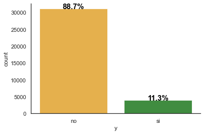


El 88.7 % de los clientes no compraron el producto, solo el 11.3% de ellos si lo hicieron.

## Variables Numéricas

##### Edad


```python
# Distribución de la edad
kdeplot('edad')
sns.despine()
```


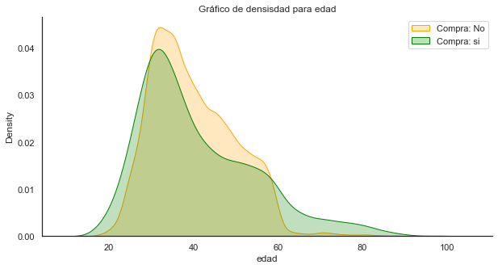


```python
# Proporción de compradores mayores a 60
clientes[clientes['edad'] >= 60]['y'].value_counts(normalize = True)
```


    no    0.604878
    si    0.395122
    Name: y, dtype: float64


```python
# Proporción de compradores menores de 22 años
clientes[clientes['edad'] <= 20]['y'].value_counts(normalize = True)
```


    no    0.595041
    si    0.404959
    Name: y, dtype: float64


Observamos que los mayores de 60 años y los menores de 21 resultaban ser buenos compradores.

##### Contactos


```python
# Distribución de contactos
kdeplot('contactos')
sns.despine()
```


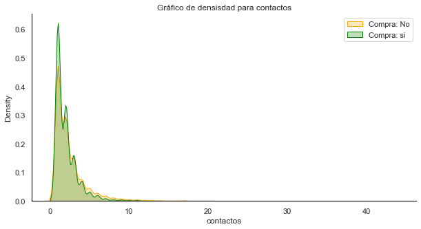


```python
clientes.groupby('contactos')['y'].value_counts(normalize = True)
```


    contactos  y 
    1          no    0.870748
               si    0.129252
    2          no    0.884817
               si    0.115183
    3          no    0.891013
               si    0.108987
    4          no    0.904615
               si    0.095385
    5          no    0.925317
               si    0.074683
    6          no    0.922156
               si    0.077844
    7          no    0.946296
               si    0.053704
    8          no    0.952522
               si    0.047478
    9          no    0.938776
               si    0.061224
    10         no    0.950000
               si    0.050000
    11         no    0.937931
               si    0.062069
    12         no    0.971963
               si    0.028037
    13         no    0.961538
               si    0.038462
    14         no    0.984375
               si    0.015625
    15         no    0.952381
               si    0.047619
    16         no    1.000000
    17         no    0.941176
               si    0.058824
    18         no    1.000000
    19         no    1.000000
    20         no    1.000000
    21         no    1.000000
    22         no    1.000000
    23         no    0.916667
               si    0.083333
    24         no    1.000000
    25         no    1.000000
    26         no    1.000000
    27         no    1.000000
    28         no    1.000000
    29         no    1.000000
    30         no    1.000000
    31         no    1.000000
    32         no    1.000000
    33         no    1.000000
    34         no    1.000000
    35         no    1.000000
    37         no    1.000000
    39         no    1.000000
    40         no    1.000000
    41         no    1.000000
    42         no    1.000000
    43         no    1.000000
    Name: y, dtype: float64


Para esta variable observamos muchas categorías con baja frecuencia, por lo que decidimos unificar algunas de ellas. Con respecto a la relación con la variable objetivo pudimos ver que el porcentaje más alto de compradores se daba para contactos = 1 con una proporción del 12.9%.

##### Variables Socioeconómicas


```python
fig, ax = plt.subplots(3,2, figsize = (12,9))
fig.tight_layout(pad = 3)

sns.boxplot(x = 'cons_conf_idx',
            y = 'y',
            data = clientes,
            boxprops=dict(alpha=.4),
            ax = ax[0,0])

sns.boxplot(x = 'euribor3m',
            y = 'y',
            data = clientes,
            boxprops=dict(alpha=.4),
            ax = ax[0,1])

sns.boxplot(x = 'cons_price_idx',
            y = 'y',
            data = clientes,
            boxprops=dict(alpha=.4),
            ax = ax[1,0])

sns.boxplot(x = 'nr_employed',
            y = 'y',
            data = clientes,
            boxprops=dict(alpha=.4),
            ax = ax[1,1])

sns.boxplot(x = 'emp_var_rate',
            y = 'y',
            data = clientes,
            boxprops=dict(alpha=.4),
            ax = ax[2,0])

fig.delaxes(ax[2,1])
sns.despine(left = True)
```


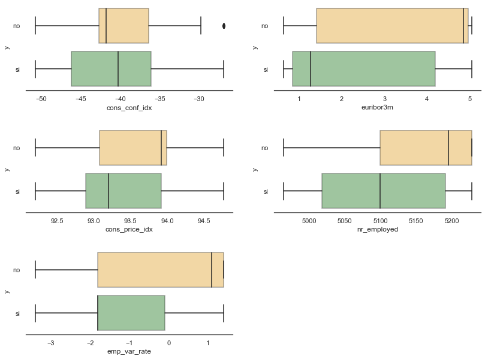


A partir de los gráficos de Box and Whiskers observamos que algunas variables parecen que se comportan igual, por ejemplo para valores altos de `euribor3m` y de `nr_employed` hay mayor proporción de clientes que no compran. EL análisis de correlación que se muestra a continuación deja en evidencia estas relaciones.

##### Análisis de Correlación


```python
plt.figure(figsize = (10, 5))
corr_matrix = clientes.corr()
sns.heatmap(corr_matrix, annot = True)
plt.show()
```


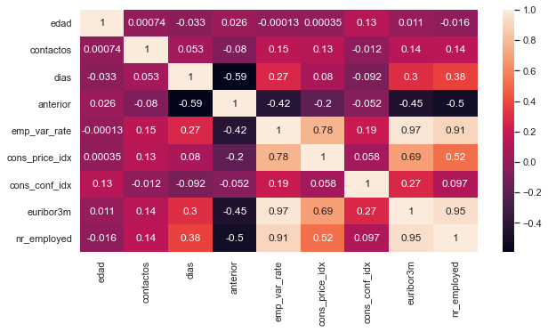


Observamos que la variable `emp.var.rate` tenía una muy alta correlación con `euribor3m` y `nr.employed`, 0.97 y 0.91 respectivamente, y una correlación igualmente importante con `cons_price_idx`. Tuvimos en cuenta esta información al momento de incorporarlas al modelo.

## Variables Categóricas

##### Estado Civil


```python
# Estado civil
plt.figure(figsize = (8, 5))
barplot_percentages("est_civ",
                   orient = 'h')
```


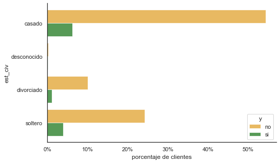


```python
clientes.groupby('est_civ')['y'].value_counts(normalize = True)
```


    est_civ      y 
    casado       no    0.898225
                 si    0.101775
    desconocido  no    0.849315
                 si    0.150685
    divorciado   no    0.900334
                 si    0.099666
    soltero      no    0.859432
                 si    0.140568
    Name: y, dtype: float64


La mayor proporción de compradores eran los solteros y los desconocidos.

##### Educación


```python
# Educación
plt.figure(figsize = (8, 5))
barplot_percentages("educacion", orient = 'h')
```


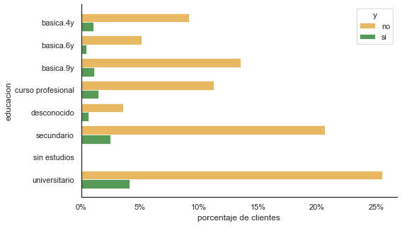


```python
clientes.groupby('educacion')['y'].value_counts(normalize = True)
```


    educacion          y 
    basica.4y          no    0.896137
                       si    0.103863
    basica.6y          no    0.921498
                       si    0.078502
    basica.9y          no    0.924462
                       si    0.075538
    curso profesional  no    0.884900
                       si    0.115100
    desconocido        no    0.851064
                       si    0.148936
    secundario         no    0.892857
                       si    0.107143
    sin estudios       no    0.750000
                       si    0.250000
    universitario      no    0.861929
                       si    0.138071
    Name: y, dtype: float64


La mayoría de los clientes pertenecían al grupo universitario y secundario. También observamos que los clientes sin estudios eran los que más compraron en proporción pero representaban un porcentaje ínfimo del total. Vamos a filtrar a este grupo de clientes.


```python
clientes[clientes['educacion'] == 'sin estudios']
```


<div>
<style scoped>
    .dataframe tbody tr th:only-of-type {
        vertical-align: middle;
    }

    .dataframe tbody tr th {
        vertical-align: top;
    }

    .dataframe thead th {
        text-align: right;
    }
</style>
<table border="1" class="dataframe">
  <thead>
    <tr style="text-align: right;">
      <th></th>
      <th>edad</th>
      <th>trabajo</th>
      <th>est_civ</th>
      <th>educacion</th>
      <th>default</th>
      <th>pres_viv</th>
      <th>pres_per</th>
      <th>contacto</th>
      <th>mes</th>
      <th>dia_sem</th>
      <th>contactos</th>
      <th>dias</th>
      <th>anterior</th>
      <th>res_ant</th>
      <th>emp_var_rate</th>
      <th>cons_price_idx</th>
      <th>cons_conf_idx</th>
      <th>euribor3m</th>
      <th>nr_employed</th>
      <th>y</th>
    </tr>
  </thead>
  <tbody>
    <tr>
      <th>69</th>
      <td>51</td>
      <td>empresario</td>
      <td>casado</td>
      <td>sin estudios</td>
      <td>no</td>
      <td>no</td>
      <td>no</td>
      <td>celular</td>
      <td>abr</td>
      <td>jue</td>
      <td>2</td>
      <td>999</td>
      <td>0</td>
      <td>inexistente</td>
      <td>-1.8</td>
      <td>93.075</td>
      <td>-47.1</td>
      <td>1.410</td>
      <td>5099.1</td>
      <td>no</td>
    </tr>
    <tr>
      <th>1594</th>
      <td>55</td>
      <td>obrero</td>
      <td>casado</td>
      <td>sin estudios</td>
      <td>no</td>
      <td>si</td>
      <td>no</td>
      <td>celular</td>
      <td>jul</td>
      <td>mar</td>
      <td>3</td>
      <td>999</td>
      <td>0</td>
      <td>inexistente</td>
      <td>1.4</td>
      <td>93.918</td>
      <td>-42.7</td>
      <td>4.961</td>
      <td>5228.1</td>
      <td>no</td>
    </tr>
    <tr>
      <th>2127</th>
      <td>80</td>
      <td>jubilado</td>
      <td>casado</td>
      <td>sin estudios</td>
      <td>desconocido</td>
      <td>si</td>
      <td>si</td>
      <td>celular</td>
      <td>ago</td>
      <td>mar</td>
      <td>1</td>
      <td>6</td>
      <td>1</td>
      <td>exitosa</td>
      <td>-2.9</td>
      <td>92.201</td>
      <td>-31.4</td>
      <td>0.883</td>
      <td>5076.2</td>
      <td>si</td>
    </tr>
    <tr>
      <th>3537</th>
      <td>42</td>
      <td>jubilado</td>
      <td>divorciado</td>
      <td>sin estudios</td>
      <td>no</td>
      <td>no</td>
      <td>no</td>
      <td>telefono</td>
      <td>ago</td>
      <td>mie</td>
      <td>3</td>
      <td>999</td>
      <td>0</td>
      <td>inexistente</td>
      <td>-2.9</td>
      <td>92.201</td>
      <td>-31.4</td>
      <td>0.834</td>
      <td>5076.2</td>
      <td>si</td>
    </tr>
    <tr>
      <th>3837</th>
      <td>45</td>
      <td>obrero</td>
      <td>casado</td>
      <td>sin estudios</td>
      <td>desconocido</td>
      <td>no</td>
      <td>no</td>
      <td>telefono</td>
      <td>may</td>
      <td>jue</td>
      <td>1</td>
      <td>999</td>
      <td>0</td>
      <td>inexistente</td>
      <td>1.1</td>
      <td>93.994</td>
      <td>-36.4</td>
      <td>4.860</td>
      <td>5191.0</td>
      <td>no</td>
    </tr>
    <tr>
      <th>3859</th>
      <td>51</td>
      <td>empresario</td>
      <td>casado</td>
      <td>sin estudios</td>
      <td>no</td>
      <td>si</td>
      <td>no</td>
      <td>celular</td>
      <td>abr</td>
      <td>jue</td>
      <td>3</td>
      <td>999</td>
      <td>0</td>
      <td>inexistente</td>
      <td>-1.8</td>
      <td>93.075</td>
      <td>-47.1</td>
      <td>1.410</td>
      <td>5099.1</td>
      <td>si</td>
    </tr>
    <tr>
      <th>8205</th>
      <td>60</td>
      <td>ama de casa</td>
      <td>casado</td>
      <td>sin estudios</td>
      <td>desconocido</td>
      <td>si</td>
      <td>no</td>
      <td>celular</td>
      <td>jul</td>
      <td>mar</td>
      <td>7</td>
      <td>999</td>
      <td>0</td>
      <td>inexistente</td>
      <td>1.4</td>
      <td>93.918</td>
      <td>-42.7</td>
      <td>4.961</td>
      <td>5228.1</td>
      <td>no</td>
    </tr>
    <tr>
      <th>10597</th>
      <td>51</td>
      <td>obrero</td>
      <td>soltero</td>
      <td>sin estudios</td>
      <td>desconocido</td>
      <td>si</td>
      <td>no</td>
      <td>celular</td>
      <td>may</td>
      <td>vie</td>
      <td>3</td>
      <td>999</td>
      <td>0</td>
      <td>inexistente</td>
      <td>-1.8</td>
      <td>92.893</td>
      <td>-46.2</td>
      <td>1.250</td>
      <td>5099.1</td>
      <td>no</td>
    </tr>
    <tr>
      <th>10954</th>
      <td>44</td>
      <td>obrero</td>
      <td>casado</td>
      <td>sin estudios</td>
      <td>no</td>
      <td>no</td>
      <td>no</td>
      <td>celular</td>
      <td>ago</td>
      <td>vie</td>
      <td>1</td>
      <td>999</td>
      <td>0</td>
      <td>inexistente</td>
      <td>1.4</td>
      <td>93.444</td>
      <td>-36.1</td>
      <td>4.964</td>
      <td>5228.1</td>
      <td>no</td>
    </tr>
    <tr>
      <th>13380</th>
      <td>34</td>
      <td>autonomo</td>
      <td>casado</td>
      <td>sin estudios</td>
      <td>no</td>
      <td>si</td>
      <td>no</td>
      <td>celular</td>
      <td>nov</td>
      <td>jue</td>
      <td>1</td>
      <td>999</td>
      <td>0</td>
      <td>inexistente</td>
      <td>-0.1</td>
      <td>93.200</td>
      <td>-42.0</td>
      <td>4.076</td>
      <td>5195.8</td>
      <td>si</td>
    </tr>
    <tr>
      <th>13812</th>
      <td>45</td>
      <td>obrero</td>
      <td>casado</td>
      <td>sin estudios</td>
      <td>desconocido</td>
      <td>no</td>
      <td>si</td>
      <td>telefono</td>
      <td>may</td>
      <td>vie</td>
      <td>2</td>
      <td>999</td>
      <td>0</td>
      <td>inexistente</td>
      <td>1.1</td>
      <td>93.994</td>
      <td>-36.4</td>
      <td>4.857</td>
      <td>5191.0</td>
      <td>no</td>
    </tr>
    <tr>
      <th>15064</th>
      <td>34</td>
      <td>autonomo</td>
      <td>casado</td>
      <td>sin estudios</td>
      <td>no</td>
      <td>si</td>
      <td>no</td>
      <td>celular</td>
      <td>nov</td>
      <td>jue</td>
      <td>1</td>
      <td>999</td>
      <td>0</td>
      <td>inexistente</td>
      <td>-0.1</td>
      <td>93.200</td>
      <td>-42.0</td>
      <td>4.076</td>
      <td>5195.8</td>
      <td>no</td>
    </tr>
    <tr>
      <th>19393</th>
      <td>42</td>
      <td>jubilado</td>
      <td>divorciado</td>
      <td>sin estudios</td>
      <td>no</td>
      <td>no</td>
      <td>no</td>
      <td>celular</td>
      <td>ago</td>
      <td>mie</td>
      <td>4</td>
      <td>999</td>
      <td>0</td>
      <td>inexistente</td>
      <td>-2.9</td>
      <td>92.201</td>
      <td>-31.4</td>
      <td>0.834</td>
      <td>5076.2</td>
      <td>no</td>
    </tr>
    <tr>
      <th>24056</th>
      <td>51</td>
      <td>administrativo</td>
      <td>casado</td>
      <td>sin estudios</td>
      <td>desconocido</td>
      <td>no</td>
      <td>no</td>
      <td>celular</td>
      <td>jul</td>
      <td>lun</td>
      <td>4</td>
      <td>999</td>
      <td>0</td>
      <td>inexistente</td>
      <td>1.4</td>
      <td>93.918</td>
      <td>-42.7</td>
      <td>4.960</td>
      <td>5228.1</td>
      <td>no</td>
    </tr>
    <tr>
      <th>27199</th>
      <td>34</td>
      <td>autonomo</td>
      <td>casado</td>
      <td>sin estudios</td>
      <td>no</td>
      <td>si</td>
      <td>no</td>
      <td>celular</td>
      <td>nov</td>
      <td>jue</td>
      <td>1</td>
      <td>999</td>
      <td>1</td>
      <td>fallida</td>
      <td>-0.1</td>
      <td>93.200</td>
      <td>-42.0</td>
      <td>4.076</td>
      <td>5195.8</td>
      <td>no</td>
    </tr>
    <tr>
      <th>33748</th>
      <td>54</td>
      <td>obrero</td>
      <td>casado</td>
      <td>sin estudios</td>
      <td>desconocido</td>
      <td>si</td>
      <td>si</td>
      <td>celular</td>
      <td>jul</td>
      <td>mar</td>
      <td>1</td>
      <td>999</td>
      <td>0</td>
      <td>inexistente</td>
      <td>1.4</td>
      <td>93.918</td>
      <td>-42.7</td>
      <td>4.961</td>
      <td>5228.1</td>
      <td>no</td>
    </tr>
  </tbody>
</table>
</div>


Efectivamente eran solo 16 registros, en los cuales observamos que tenemos a personas cuyos trabajos son administrativos o empresarios, posiblemente esto sea un error ya que no tienen ni siquiera estudios primarios.

##### Default


```python
# Default
plt.figure(figsize = (8, 5))
barplot_percentages("default")
```


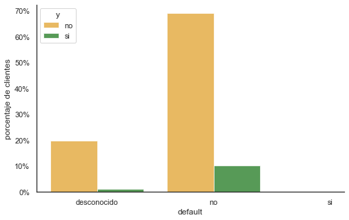


```python
clientes.groupby('default')['y'].value_counts(normalize = True)
```


    default      y 
    desconocido  no    0.948141
                 si    0.051859
    no           no    0.871465
                 si    0.128535
    si           no    1.000000
    Name: y, dtype: float64


Quienes más compraron son los clientes que no tenían default. También observamos que prácticamente no hay registros con default = 'si'.


```python
clientes[clientes['default'] == 'si']
```


<div>
<style scoped>
    .dataframe tbody tr th:only-of-type {
        vertical-align: middle;
    }

    .dataframe tbody tr th {
        vertical-align: top;
    }

    .dataframe thead th {
        text-align: right;
    }
</style>
<table border="1" class="dataframe">
  <thead>
    <tr style="text-align: right;">
      <th></th>
      <th>edad</th>
      <th>trabajo</th>
      <th>est_civ</th>
      <th>educacion</th>
      <th>default</th>
      <th>pres_viv</th>
      <th>pres_per</th>
      <th>contacto</th>
      <th>mes</th>
      <th>dia_sem</th>
      <th>contactos</th>
      <th>dias</th>
      <th>anterior</th>
      <th>res_ant</th>
      <th>emp_var_rate</th>
      <th>cons_price_idx</th>
      <th>cons_conf_idx</th>
      <th>euribor3m</th>
      <th>nr_employed</th>
      <th>y</th>
    </tr>
  </thead>
  <tbody>
    <tr>
      <th>355</th>
      <td>31</td>
      <td>desocupado</td>
      <td>casado</td>
      <td>secundario</td>
      <td>si</td>
      <td>no</td>
      <td>no</td>
      <td>celular</td>
      <td>nov</td>
      <td>mar</td>
      <td>2</td>
      <td>999</td>
      <td>1</td>
      <td>fallida</td>
      <td>-0.1</td>
      <td>93.2</td>
      <td>-42.0</td>
      <td>4.153</td>
      <td>5195.8</td>
      <td>no</td>
    </tr>
  </tbody>
</table>
</div>


Efectivamente había un solo registro.

##### Préstamo Vivienda / Préstamo Personal


```python
clientes[['pres_per','pres_viv']].value_counts().reset_index()
```


<div>
<style scoped>
    .dataframe tbody tr th:only-of-type {
        vertical-align: middle;
    }

    .dataframe tbody tr th {
        vertical-align: top;
    }

    .dataframe thead th {
        text-align: right;
    }
</style>
<table border="1" class="dataframe">
  <thead>
    <tr style="text-align: right;">
      <th></th>
      <th>pres_per</th>
      <th>pres_viv</th>
      <th>0</th>
    </tr>
  </thead>
  <tbody>
    <tr>
      <th>0</th>
      <td>no</td>
      <td>si</td>
      <td>15197</td>
    </tr>
    <tr>
      <th>1</th>
      <td>no</td>
      <td>no</td>
      <td>13672</td>
    </tr>
    <tr>
      <th>2</th>
      <td>si</td>
      <td>si</td>
      <td>3135</td>
    </tr>
    <tr>
      <th>3</th>
      <td>si</td>
      <td>no</td>
      <td>2167</td>
    </tr>
    <tr>
      <th>4</th>
      <td>desconocido</td>
      <td>desconocido</td>
      <td>839</td>
    </tr>
  </tbody>
</table>
</div>


```python
# Préstamo vivienda
plt.figure(figsize = (8, 5))
barplot_percentages("pres_viv",
                   orient = 'h')
```


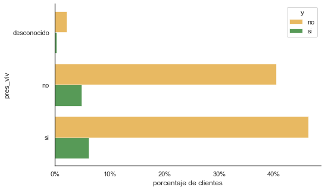


```python
# Préstamo Personal
plt.figure(figsize = (8, 5))
barplot_percentages("pres_per",
                   orient = 'h')
```


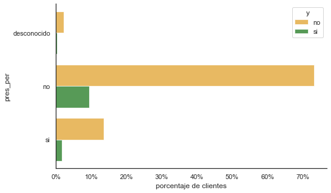


```python
clientes.groupby('pres_per')['y'].value_counts(normalize = True)
```


    pres_per     y 
    desconocido  no    0.896305
                 si    0.103695
    no           no    0.887076
                 si    0.112924
    si           no    0.887967
                 si    0.112033
    Name: y, dtype: float64


Observamos que ambas variables se distribuían igual respecto a la variable objetivo indicando que posiblemente no sea necesario incorporar ambas variables.

##### Contacto


```python
# Contacto
plt.figure(figsize = (8, 5))
barplot_percentages("contacto")
```


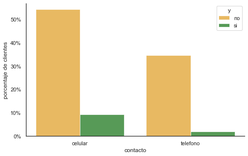


```python
clientes.groupby('contacto')['y'].value_counts(normalize = True)
```


    contacto  y 
    celular   no    0.852801
              si    0.147199
    telefono  no    0.947760
              si    0.052240
    Name: y, dtype: float64


Observamos una mayor proporción de ventas cuando el contacto se realizaba por celular.

##### Mes


```python
# Mes
plt.figure(figsize = (12, 5))
barplot_percentages("mes",
                   orient = 'h')
```


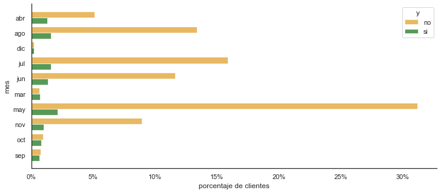


```python
clientes.groupby('mes')['y'].value_counts(normalize = True)
```


    mes  y 
    abr  no    0.798308
         si    0.201692
    ago  no    0.895078
         si    0.104922
    dic  no    0.509317
         si    0.490683
    jul  no    0.908853
         si    0.091147
    jun  no    0.897797
         si    0.102203
    mar  si    0.514957
         no    0.485043
    may  no    0.935846
         si    0.064154
    nov  no    0.899453
         si    0.100547
    oct  no    0.547855
         si    0.452145
    sep  no    0.540816
         si    0.459184
    Name: y, dtype: float64


La proporción de ventas en los meses de Marzo, Octubre, Septiembre y Diciembre fue mayor al 45%.

##### Día Semana


```python
# Día de la semana
plt.figure(figsize = (8, 5))
barplot_percentages("dia_sem",
                   orient = 'h')
```


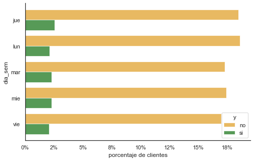


```python
clientes.groupby('dia_sem')['y'].value_counts(normalize = True)
```


    dia_sem  y 
    jue      no    0.879712
             si    0.120288
    lun      no    0.898537
             si    0.101463
    mar      no    0.883280
             si    0.116720
    mie      no    0.883350
             si    0.116650
    vie      no    0.892375
             si    0.107625
    Name: y, dtype: float64


No observamos variación importante de ventas con respecto al día de la semana. 

##### Trabajo


```python
# Trabajo
plt.figure(figsize = (8, 5))
barplot_percentages("trabajo",
                   orient = 'h')
```


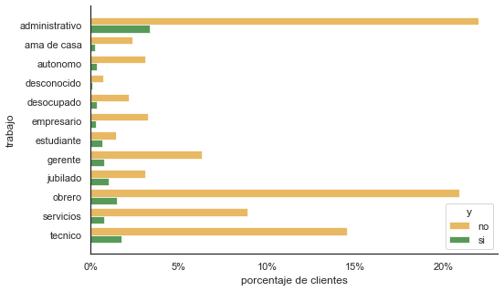


```python
clientes.groupby('trabajo')['y'].value_counts(normalize = True)
```


    trabajo         y 
    administrativo  no    0.867012
                    si    0.132988
    ama de casa     no    0.903575
                    si    0.096425
    autonomo        no    0.893212
                    si    0.106788
    desconocido     no    0.880702
                    si    0.119298
    desocupado      no    0.864310
                    si    0.135690
    empresario      no    0.916734
                    si    0.083266
    estudiante      no    0.684426
                    si    0.315574
    gerente         no    0.891093
                    si    0.108907
    jubilado        no    0.749829
                    si    0.250171
    obrero          no    0.932238
                    si    0.067762
    servicios       no    0.918831
                    si    0.081169
    tecnico         no    0.892238
                    si    0.107762
    Name: y, dtype: float64


Estudiantes y jubilados son los que más compraban en proporción. Algo de esto vimos en el gráfico de la distribución de los clientes por edad.

##### Anterior


```python
# Anterior
plt.figure(figsize = (8, 5))
barplot_percentages("anterior")
```


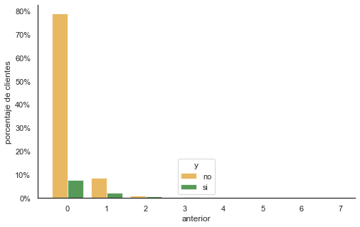


```python
clientes.groupby('anterior')['y'].value_counts()
```


    anterior  y 
    0         no    27565
              si     2664
    1         no     3048
              si      824
    2         no      352
              si      297
    3         si      109
              no       73
    4         si       34
              no       23
    5         si       11
              no        5
    6         no        2
              si        2
    7         no        1
    Name: y, dtype: int64


Nuevamente observamos muy baja frecuencia de algunas categorías por lo que decidimos reagrupar algunas de ellas.


```python
clientes.groupby('anterior')['y'].value_counts(normalize = True)
```


    anterior  y 
    0         no    0.911873
              si    0.088127
    1         no    0.787190
              si    0.212810
    2         no    0.542373
              si    0.457627
    3         si    0.598901
              no    0.401099
    4         si    0.596491
              no    0.403509
    5         si    0.687500
              no    0.312500
    6         no    0.500000
              si    0.500000
    7         no    1.000000
    Name: y, dtype: float64


##### Resultado Anterior


```python
# Resultado Anterior
plt.figure(figsize = (8, 5))
barplot_percentages("res_ant")
```


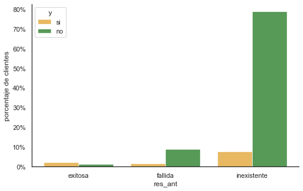


```python
clientes.groupby('res_ant')['y'].value_counts(normalize = True)
```


    res_ant      y 
    exitosa      si    0.644970
                 no    0.355030
    fallida      no    0.857143
                 si    0.142857
    inexistente  no    0.911873
                 si    0.088127
    Name: y, dtype: float64


El 65% de los clientes que habían comprado en campañas anteriores volvieron a adquirir el producto bancario. Esta sin dudas es una variable con gran valor predictivo.

##### Días


```python
# Días
plt.figure(figsize = (8, 5))
barplot_percentages("dias")
```


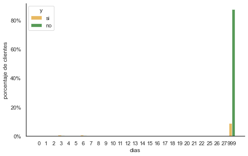


```python
clientes.groupby('dias')['y'].value_counts(normalize = True)
```


    dias  y 
    0     si    0.615385
          no    0.384615
    1     no    0.714286
          si    0.285714
    2     si    0.584906
          no    0.415094
    3     si    0.665775
          no    0.334225
    4     si    0.538462
          no    0.461538
    5     si    0.657895
          no    0.342105
    6     si    0.693151
          no    0.306849
    7     si    0.642857
          no    0.357143
    8     si    0.714286
          no    0.285714
    9     si    0.571429
          no    0.428571
    10    si    0.560976
          no    0.439024
    11    si    0.520000
          no    0.480000
    12    no    0.538462
          si    0.461538
    13    si    0.774194
          no    0.225806
    14    si    0.529412
          no    0.470588
    15    si    0.619048
          no    0.380952
    16    no    0.500000
          si    0.500000
    17    no    0.750000
          si    0.250000
    18    si    0.571429
          no    0.428571
    19    no    0.666667
          si    0.333333
    20    no    1.000000
    21    si    1.000000
    22    si    0.666667
          no    0.333333
    25    si    1.000000
    26    si    1.000000
    27    si    1.000000
    999   no    0.907642
          si    0.092358
    Name: y, dtype: float64


```python
clientes['dias'].value_counts(normalize = True)
```


    999    0.962439
    3      0.010683
    6      0.010426
    4      0.002971
    9      0.001600
    7      0.001600
    2      0.001514
    12     0.001485
    10     0.001171
    5      0.001085
    13     0.000885
    11     0.000714
    1      0.000600
    15     0.000600
    14     0.000486
    8      0.000400
    0      0.000371
    16     0.000229
    17     0.000229
    18     0.000200
    19     0.000086
    22     0.000086
    26     0.000029
    20     0.000029
    21     0.000029
    25     0.000029
    27     0.000029
    Name: dias, dtype: float64


Nuevamente observamos categorías con muy baja frecuencia. El 96% de los clientes estaban etiquetados con 999 lo que significa que no han sido contactados en campañas anteriores.

# División Train y Test

A fin de poder validar nuestro modelo separamos el dataset en un set de entrenamiento y un set de validación.


```python
X = clientes.drop(['y'], axis = 1)
y = clientes['y']

X_train, X_test, y_train, y_test = train_test_split(X,
                                                    y, 
                                                    test_size = 0.20, 
                                                    random_state = 42,
                                                    stratify = y)

print(X_train.shape, X_test.shape, y_train.shape, y_test.shape)
```

    (28008, 19) (7002, 19) (28008,) (7002,)
    

# Data Cleaning / Feature Engineering

Realizamos el data cleaning sobre el set de entrenamiento y luego aplicamos las mismas modificaciones sobre el set de prueba. Esto es necesario ya que al imputar valores desconocidos podríamos estar calculando medias o valores más frecuentes utilizando los mismos datos que servirán para testear el modelo lo que implicaría causar data leakage.


```python
# Juntamos las variables predictivas con la objetivo.
train = pd.concat([X_train,
                   y_train],
                   axis = 1).reset_index()

test = pd.concat([X_test,
                  y_test],
                  axis = 1).reset_index()
```

## Valores Desconocidos / Ausentes

En este dataset los valores nulos han sido etiquetados como valores desconocidos los cuales se encontraban dentro de los siguientes atributos.


```python
train.replace('desconocido', np.nan).isnull().sum()
```


    index                0
    edad                 0
    trabajo            239
    est_civ             62
    educacion         1148
    default           5832
    pres_viv           668
    pres_per           668
    contacto             0
    mes                  0
    dia_sem              0
    contactos            0
    dias                 0
    anterior             0
    res_ant              0
    emp_var_rate         0
    cons_price_idx       0
    cons_conf_idx        0
    euribor3m            0
    nr_employed          0
    y                    0
    dtype: int64


Observamos valores desconocidos en las variables `trabajo`, `est_civ`, `educacion`, `default`, `pres_viv` y `pres_per`.

Las estrategias que se suelen tomar para lidiar con valores desconocidos son principalmente tres: eliminarlos, dejarlos como están o bien intentar imputarlos. Para este último punto consideramos lo siguiente:

 - Imputar los valores desconocidos en `trabajo` a partir de la profesión, es decir, observando para cada profesión cuál es el nivel educativo más frecuente. De la misma manera podemos completar los desconocidos en `educacion` observando cuál es el trabajo más frecuente.

 - Para los valores desconocidos en el estado civil podría utilizarse la edad.
 
 - Para el caso de `default` podríamos imputarlo a través de alguna variable socioeconómica.
 
 - En `pres_per` y `pres_viv` observamos que tenían la misma cantidad de desconocidos. En el análisis gráfico también vimos que no parecían ser variables que afecten a la variable de respuesta por lo que quizás sea mejor eliminarlas.


```python
train[(train['pres_per'] == 'desconocido') & 
      (train['pres_viv'] == 'desconocido')].shape
```


    (668, 21)


Efectivamente, observamos 668 registros con valores desconocidos en forma simultánea en `pres_per` y `pres_viv`.

## Registros Duplicados

Dentro del dataset observamos 1312 registros duplicados. Si tenemos en cuenta que queremos que nuestro modelo predictivo obtenga buenos resultados en datos nunca vistos, una buena idea es que no hayan registros duplicados entre el set de de entrenamiento y el set de prueba ya que el modelo los calificará correctamente.


```python
# Registros duplicados
clientes.duplicated().sum()
```


    1312


## Función Cleaner/Imputer

Armamos una función cleaner para procesar los datos de entrenamiento según las observaciones que fuimos realizando a partir del análisis gráfico y de distribución de las variables. Luego utilizamos la misma función para procesar el set de prueba.


```python
def cleaner(datos):
    
  # MODIFICACIÓN DE ATRIBUTOS Y CATEGORÍAS
  # ======================================
  
  # Variable Objetivo:
  # ------------------
  # Pasamos la variable objetivo a ceros y unos.
  
  datos['y'] = datos['y'].apply(lambda x: 0 if x == 'no' else 1)
  
  # Educacion:
  # ----------
  # Unificamos categorías
                                
  if True:
    datos.replace({'basica.4y'        : 'primaria',
                   'basica.6y'        : 'primaria',
                   'basica.9y'        : 'primaria',
                   'sin estudios'     : 'no',
                   'curso profesional': 'curso'},
                    inplace = True)

 # Dias
 # ----
 # Dado que 999 significa que el cliente no fue contactado previamente 
 # -- lo clasificamos con 0.
                                
  if True:                          
    datos['dias'].replace({999 : 0},
                          inplace = True)

  # Contactos
  # ----
  # Categoría 4 significa mayor a 4 contactos (reducimos categorías).
                                
  if True:                 
    datos['contactos'] = datos['contactos'].mask(datos['contactos'] >= 4, 4)


  # Anterior
  # --------
  # Categoría 2 significa mayor a 2 días (reducimo categorías).
                                
  if True:
   datos['anterior'] = datos['anterior'].mask(datos['anterior'] >= 2, 2)


  # ELIMINACIÓN DE VARIABLES CORRELACIONADAS/NO PREDICTORAS 
  # =======================================================
  # Según el análisis gráfico eliminamos 3 variables socioeconómicas, las
  # -- variables pres_viv, pres_per y la variable dia_sem
  
  if True:
    no_pred = [
               'euribor3m',
               'nr_employed',
               'pres_viv',
               'pres_per',
               'dia_sem']

    datos.drop(no_pred,
               axis    = 1,
               inplace = True)

  # ELIMINACIÓN/CORRECCIÓN DE OUTLIERS (True/False)
  # ==================================
  # Educación
  # ---------
  # Dado que observamos empresarios y administrativos sin estudios 
  # -- (ni siquiere básico),
  # -- vamos a reemplazarlo por desconocidos (luego se imputarán a lo que
  # -- corresponda)

  if True:
    condition = ((datos['trabajo']   == 'empresario')      | \
                 (datos['trabajo']   == 'administrativo')) & \
                 (datos['educacion'] == 'no')
  
    datos['educacion'] = np.where(
                                 (condition),
                                 'desconocido',
                                 datos['educacion'])
  
  # Default
  # -------
  # Tenemos 1 solo registro con default = si,
  # --vamos a considerarlo como desconocido.
  
  if True:
    condition = (datos['default'] == 'si')
    datos['default'] = np.where(
                                (condition),
                                'desconocido',
                                datos['default'])


  # IMPUTACIÓN DE VALORES DESCONOCIDOS
  # ==================================
  # TRABAJO Y EDUCACION
  # -------------------
  # Desconocidos, amas de casa y desempleados > 64 --> jubilados 
  
  # Antes de cada imputación verifico que el resultado según las condiciones no
  # --sea vacío.

  if True:
    condition = ((datos['trabajo'] == 'desconocido')  | \
                 (datos['trabajo'] == 'ama de casa')  | \
                 (datos['trabajo'] == 'desempleado'))  & \
                 (datos['edad']     >  64)
  
    if (datos[condition]).size > 0:  
      datos['trabajo'] = np.where((condition),
                                  'jubilado',
                                  datos['trabajo'])
  
  # Desconocidos y < 18 años --> estudiantes

  if True:
    condition = (datos['trabajo'] == 'desconocido')  &  \
                (datos['edad']    <=  18)
    
    if (datos[condition]).size > 0:  
      datos['trabajo'] = np.where((condition),
                                  'estudiante',
                                  datos['trabajo'])

  # Trabajo y Educacion (ambos desconocidos) -- > se eliminan ya que voy a usar
  # -- uno para imputar el otro.
  
  if False: # True para train y test set / False para validaton set
    indice = datos[(datos['trabajo']   == 'desconocido') & \
                   (datos['educacion'] == 'desconocido')].index
    
    datos.drop(datos.index[indice],
               inplace = True)

  # Ya no tenemos desconocidos en trabajo y educación simultáneamente.
  # Vamos a reemplazar los desconocidos en educación infiriendo a partir 
  # --del tipo de trabajo.
  # Utilizamos la máxima frecuencia, por ejemplo para administrativo -- > universitario, luego

  if True:
    jobs = datos['trabajo'].unique()
    
    for job in jobs:
    
      # Obtenemos la categoría de educación más frecuente para cada tipo de trabajo
      max_freq_job = datos[datos['trabajo'] == job]['educacion'] \
                                .value_counts().index[0]
    
      # Reemplazamos la categoria desconocido de la educacion por la más frecuente
      condition = (datos['educacion'] == 'desconocido') & \
                  (datos['trabajo']   == job)
    
      datos['educacion'] = np.where(
                                   (condition) ,
                                   max_freq_job,
                                   datos['educacion'])
    
  # Ahora imputamos los tipos de trabajo con el procedimiento inverso al anterior.
  
  if True:
    studies = datos['educacion'].unique()
    
    for std in studies:
    
      # Obtenemos la categoría de trabajo más frecuente para cada tipo de educación
      max_freq_std = datos[datos['educacion'] == std]['trabajo'] \
                                .value_counts().index[0]
    
      # Reemplazamos la categoria desconocida del trabajo por la más frecuente
      condition = (datos['trabajo']   == 'desconocido') & \
                  (datos['educacion'] ==  std)
    
      datos['trabajo'] = np.where(
                                   (condition),
                                   max_freq_std,
                                   datos['trabajo'])
        
   # Ya no quedan desconocidos en trabajo.

   # ESTADO CIVIL
   # ------------
   # Vamos a imputar el estado civil a partir de la frecuencia por rango de edades.
   # Creamos una varibale nueva solo para obtener frecuencias por rangos de edad. Luego la elimino.

  if True:
    bins = [18, 25, 35, 45, 55, 65, 98]
    rangos = [1, 2, 3, 4, 5, 6]
    datos['edad_rango'] = pd.cut(datos['edad'],
                                 bins   = bins,
                                 labels = rangos,
                                 right  = False)
  
    for age in rangos:
      max_freq_age = datos[datos['edad_rango'] == age]['est_civ'] \
                                .value_counts().index[0]
    
      condition = (datos['est_civ']    == 'desconocido') & \
                  (datos['edad_rango'] ==  age)
    
      datos['est_civ'] = np.where(
                                  (condition),
                                  max_freq_age,
                                  datos['est_civ'])
      
    # Eliminamos la columna de rango de edades
    datos.drop(['edad_rango'],
               axis    = 1,
               inplace = True,
               errors  = 'ignore')


  # ELIMINACIÓN REGISTROS DUPLICADOS
  # ================================
  
  if False: # True para train y test set / False para validaton set
    datos.drop_duplicates(inplace      = True,
                          ignore_index = True)
  
  # Convertimos las columnas a categóricas
  # ======================================

  if True:
    cols = datos.select_dtypes('object').columns.to_list()
    datos[cols] = datos[cols].astype('category')
```

# Métrica de Evaluación

Para poder calcular el costo/beneficio de la campaña se fijaron los siguientes parámetros:

 - Para el caso de las llamadas fallidas se definió un costo unitario de 440 unidades monetarias (UM). Estas llamadas son más cortas que las exitosas, debido a que la mayoría de los clientes no aceptan el producto ofrecido de inmediato y otros terminan decidiendo rechazar la propuesta en llamados subsiguientes.


 - En el caso de una llamada exitosa (se vende el producto) la mediana del tiempo de contacto con el potencial comprador es mayor, también requiere incurrir en gastos administrativos y de asesoramiento extra. A partir de datos pasados en dónde se calculó la ganancia después de impuestos y gastos utilizando el monto promedio invertido se obtuvo que cada llamada exitosa le dejaba a la empresa 2900 UM. 
 
- Es importante mencionar que se premiaba la detección de clientes que no se llaman por ser considerados como negativos. Esta premiación está asociada a diferentes costos de oportunidad, tanto de la contratación/tercerización de empleados/consultoría de Data Science, como también a la contratación de empresas de tele-marketing y la consecuente capacitación  técnica del equipo del call center para una atención acorde a las particularidades y complejidades de la situación,  incrementando así los costos contractuales con la empresa tercerizada. Por estos motivos, se le asignó una ganancia de 200 UM a la detección de clientes a los que no se debe ofrecer el producto. .


A partir de esta información construimos una matriz de costo/beneficio con la cual es posible monetizar el resultado del modelo de clasificación.

|  | Llamada Exitosa (E) | Llamada Fallida (F) |
| --- | --- | --- |
| Llamada Realizada (R)| 2900 | -440 |
| Llamada No Realizada (NR)| 0 | 200 |

# Preprocesado

El primer paso fue llamar a la función cleaner/imputer para aplicar la estrategia de limpieza y transformación de datos utilizados para el train y para el test del modelo.


```python
cleaner(train)
cleaner(test)
print(train.shape)
print(test.shape)
```

    (27920, 16)
    (6983, 16)
    


```python
train.head()
```


<div>
<style scoped>
    .dataframe tbody tr th:only-of-type {
        vertical-align: middle;
    }

    .dataframe tbody tr th {
        vertical-align: top;
    }

    .dataframe thead th {
        text-align: right;
    }
</style>
<table border="1" class="dataframe">
  <thead>
    <tr style="text-align: right;">
      <th></th>
      <th>index</th>
      <th>edad</th>
      <th>trabajo</th>
      <th>est_civ</th>
      <th>educacion</th>
      <th>default</th>
      <th>contacto</th>
      <th>mes</th>
      <th>contactos</th>
      <th>dias</th>
      <th>anterior</th>
      <th>res_ant</th>
      <th>emp_var_rate</th>
      <th>cons_price_idx</th>
      <th>cons_conf_idx</th>
      <th>y</th>
    </tr>
  </thead>
  <tbody>
    <tr>
      <th>0</th>
      <td>20877</td>
      <td>30</td>
      <td>administrativo</td>
      <td>casado</td>
      <td>primaria</td>
      <td>no</td>
      <td>celular</td>
      <td>jul</td>
      <td>1</td>
      <td>0</td>
      <td>0</td>
      <td>inexistente</td>
      <td>1.4</td>
      <td>93.918</td>
      <td>-42.7</td>
      <td>0</td>
    </tr>
    <tr>
      <th>1</th>
      <td>12729</td>
      <td>40</td>
      <td>tecnico</td>
      <td>casado</td>
      <td>curso</td>
      <td>no</td>
      <td>celular</td>
      <td>ago</td>
      <td>2</td>
      <td>0</td>
      <td>0</td>
      <td>inexistente</td>
      <td>1.4</td>
      <td>93.444</td>
      <td>-36.1</td>
      <td>0</td>
    </tr>
    <tr>
      <th>2</th>
      <td>8374</td>
      <td>33</td>
      <td>servicios</td>
      <td>casado</td>
      <td>secundario</td>
      <td>no</td>
      <td>celular</td>
      <td>jul</td>
      <td>4</td>
      <td>0</td>
      <td>0</td>
      <td>inexistente</td>
      <td>1.4</td>
      <td>93.918</td>
      <td>-42.7</td>
      <td>0</td>
    </tr>
    <tr>
      <th>3</th>
      <td>16409</td>
      <td>59</td>
      <td>jubilado</td>
      <td>casado</td>
      <td>curso</td>
      <td>no</td>
      <td>telefono</td>
      <td>may</td>
      <td>3</td>
      <td>0</td>
      <td>0</td>
      <td>inexistente</td>
      <td>1.1</td>
      <td>93.994</td>
      <td>-36.4</td>
      <td>0</td>
    </tr>
    <tr>
      <th>4</th>
      <td>24307</td>
      <td>50</td>
      <td>gerente</td>
      <td>divorciado</td>
      <td>universitario</td>
      <td>no</td>
      <td>celular</td>
      <td>nov</td>
      <td>4</td>
      <td>0</td>
      <td>0</td>
      <td>inexistente</td>
      <td>-0.1</td>
      <td>93.200</td>
      <td>-42.0</td>
      <td>0</td>
    </tr>
  </tbody>
</table>
</div>


Luego volvimos a separar las variables predictivas de la variable objetivo para poder introducirlos en el modelo.


```python
# Separamos los sets de entrenamiento y testeo
X_train = train.drop(['y', 'index'], axis = 1)
y_train = train['y']

X_test = test.drop(['y', 'index'], axis = 1)
y_test = test['y']

print(X_train.shape)
print(y_train.shape)
print(X_test.shape)
print(y_test.shape)
```

    (27920, 14)
    (27920,)
    (6983, 14)
    (6983,)
    

También realizamos una estandarización de las variables numéricas y un one hot encoding a las categóricas.


```python
# One Hot Encoding y Estandarización
# =================================

numeric_cols = X_train.select_dtypes(include = ['float64', 'int64']) \
                  .columns.to_list()
cat_cols = X_train.select_dtypes(include=['object', 'category']) \
                  .columns.to_list()
    
preprocessor = ColumnTransformer(
                       [
                        ('scale', StandardScaler(), numeric_cols),
                        ('onehot', OneHotEncoder(), cat_cols)],
                    remainder = 'passthrough')
    
X_train = preprocessor.fit_transform(X_train)
X_test  = preprocessor.transform(X_test)
```

# Modelado

Desarrollamos diferentes modelos de clasificación binaria utilizando algoritmos de Regresión Logística, Árboles de Decisión, Random Forest, Support Vector Machine y Ensambles. Finalmente, el modelo que arrojó los mejores resultados según la métrica fue el Random Forest Classifier.

Para el entrenamiento de estos modelos utilizamos la función GridSearchCv de la librería Scikit Learn con una estrategia de 5 fold cross validation definiendo una función custom scorer como regla de optimización. En esta función se introdujeron los coeficientes de ganancias y perdidas de la matriz de beneficio y se la configuró a modo de maximizar la utilidad esperada.


```python
# Función de la matriz de costo/beneficio
# =======================================
def benefitmatrix_score(y_true, y_pred):
    tn, fp, fn, tp = confusion_matrix(y_true,
                                      y_pred).ravel()
    return (200 * tn + 2900 * tp + (-440) * fp) / len(y_true)
```


```python
# Entrenamiento y búsqueda de los mejores hiperpaámetros
# ======================================================


n_estimators     = [150, 300, 400]
max_depth        = [7, 11, 15]
min_samples_leaf = [5, 10, 15]
max_features     = ['sqrt', 'auto']
bootstrap        = [True, False]

hyperparametros = dict(
                       n_estimators     = n_estimators, 
                       min_samples_leaf = min_samples_leaf,
                       max_depth        = max_depth,
                       max_features     = max_features,
                       bootstrap        = bootstrap
                       )

rfc_model = RandomForestClassifier(class_weight = 'balanced',
                                   random_state =  42)

custom_scorer = {"Matriz_de_beneficio" : 
                 make_scorer(benefitmatrix_score, greater_is_better = True)
                 }

clf = GridSearchCV(rfc_model,
                   hyperparametros,
                   cv                 = 5,
                   verbose            = 4,
                   scoring            = custom_scorer,
                   n_jobs             = -1,
                   refit              = "Matriz_de_beneficio",
                   return_train_score = True)

# Entrenamiento
rfc_model = clf.fit(X_train, y_train)
print("----------------------------------------")
print("Mejores hiperparámetros encontrados (cv)")
print("----------------------------------------")
print(rfc_model.best_params_)

# Predicciones
y_pred = rfc_model.predict(X_test)
plot_confusion_matrix(algoritmo, X_train, y_train,normalize='true')
plot_confusion_matrix(algoritmo,
                          X_test,
                          y_test,
                          values_format  = 'd')

print('--------------------------------------------')
print("Beneficio Esperado (train): ", rfc_model.score(X_train, y_train))
print("Beneficio Esperado (test): ", rfc_model.score(X_test, y_test))
print('--------------------------------------------')
print(classification_report(y_test, y_pred))
```

    Fitting 5 folds for each of 108 candidates, totalling 540 fits
    

    [Parallel(n_jobs=-1)]: Using backend LokyBackend with 4 concurrent workers.
    [Parallel(n_jobs=-1)]: Done  17 tasks      | elapsed:  1.2min
    [Parallel(n_jobs=-1)]: Done  90 tasks      | elapsed:  6.2min
    [Parallel(n_jobs=-1)]: Done 213 tasks      | elapsed: 16.3min
    [Parallel(n_jobs=-1)]: Done 384 tasks      | elapsed: 30.9min
    [Parallel(n_jobs=-1)]: Done 540 out of 540 | elapsed: 49.3min finished
    

    ----------------------------------------
    Mejores hiperparámetros encontrados (cv)
    ----------------------------------------
    {'bootstrap': True, 'max_depth': 15, 'max_features': 'sqrt', 'min_samples_leaf': 5, 'n_estimators': 300}
    --------------------------------------------
    Beneficio Esperado (train):  327.8137535816619
    Beneficio Esperado (test):  307.45238436202203
    --------------------------------------------
                  precision    recall  f1-score   support
    
               0       0.95      0.88      0.91      6199
               1       0.39      0.61      0.48       784
    
        accuracy                           0.85      6983
       macro avg       0.67      0.74      0.69      6983
    weighted avg       0.88      0.85      0.86      6983
    
    


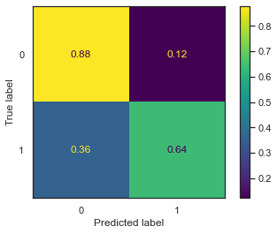


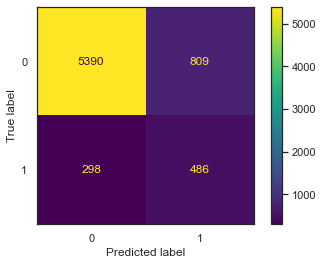


```python
# Guardamos en una lista los nombres de los parametros
masks = []
masks_names = list(clf.best_params_.keys())
for p_k, p_v in clf.best_params_.items():
  masks.append(list(results['param_'+ p_k].data == p_v))

params = clf.param_grid

# Resultados del grid search
results     = clf.cv_results_
means_test  = results['mean_test_Matriz_de_beneficio']
stds_test   = results['std_test_Matriz_de_beneficio']
means_train = results['mean_train_Matriz_de_beneficio']
stds_train  = results['std_train_Matriz_de_beneficio']


fig, ax = plt.subplots(nrows   = 3,
                       ncols   = 2,
                       sharex  = 'none',
                       sharey  = 'none',
                       figsize = (10,14)
                      ) 
fig.tight_layout(pad = 4)

fig.delaxes(ax[2,1]) 
fig.text(0.04, 0.5, 'MEAN SCORE', va = 'center', rotation = 'vertical')

ax = ax.flatten()
pram_preformace_in_best = {}

for i, p in enumerate(masks_names):
  m = np.stack(masks[:i] + masks[i + 1:])
  pram_preformace_in_best
  best_parms_mask = m.all(axis = 0)
  best_index = np.where(best_parms_mask)[0]
  x   = np.array(params[p])
  y_1 = np.array(means_test[best_index])
  e_1 = np.array(stds_test[best_index])
  y_2 = np.array(means_train[best_index])
  e_2 = np.array(stds_train[best_index])
  ax[i].errorbar(x, y_1, e_1, linestyle='--', marker='o', label='test')
  ax[i].errorbar(x, y_2, e_2, linestyle='-', marker='^',label='train' )
  ax[i].set_xlabel(p.upper())
  ax[i].legend()
fig.suptitle('Performance por parámetro')
sns.despine()
plt.show()
```


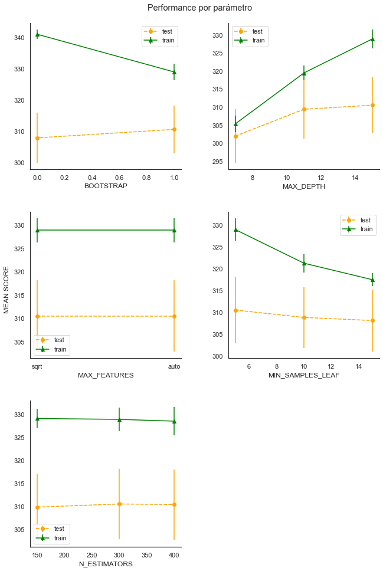


De acuerdo al análisis de los resultados de las curvas del punto anterior, seleccionamos los hiperparámetros que maximizaron el beneficio teniendo en cuenta de buscar un equilibrio entre los resultados del train y el test set, es decir, evitar el overfitting.


```python
# Modelo con los mejores parámetros
# =================================

best_rfc = RandomForestClassifier(class_weight      = 'balanced',
                                   random_state     =  42,
                                   n_estimators     =  300, 
                                   min_samples_leaf =  5,
                                   max_depth        =  15,
                                   max_features     =  'sqrt',
                                   bootstrap        =  True)

# Entrenamiento
best_rfc = best_rfc.fit(X_train, y_train)

# Predicciones
y_pred = best_rfc.predict(X_test)
plot_confusion_matrix(best_rfc,
                      X_test,
                      y_test,
                      values_format  = 'd')

print()
print("Beneficio Esperado (test): {:.2f}" \ 
      .format(benefitmatrix_score(y_test, y_pred)))
print()
print(classification_report(y_pred, y_test))

```

    
    Beneficio Esperado (test): 307.45
    
                  precision    recall  f1-score   support
    
               0       0.88      0.95      0.91      5762
               1       0.61      0.39      0.48      1221
    
        accuracy                           0.85      6983
       macro avg       0.74      0.67      0.69      6983
    weighted avg       0.83      0.85      0.84      6983
    
    


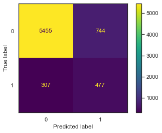


Concluimos que este modelo era el que mejor resultados nos daba y el de mayor poder predictivo que maximizaba el beneficio esperado. Veamos como fueron los resultados cuando se lo utilizó para predecir datos nunca vistos.

# Set de Datos de Evaluación Final

El modelo tuneado se utilizó para calcular el beneficio esperado en el set de datos de validación final, este set de datos fue provisto luego de la presentación final, es por eso que podemos replicar los resultados arrojados para definir al modelo ganador.


```python
dev_test = pd.read_csv('mkt_bank_test.csv')
dev_test.head()
```


<div>
<style scoped>
    .dataframe tbody tr th:only-of-type {
        vertical-align: middle;
    }

    .dataframe tbody tr th {
        vertical-align: top;
    }

    .dataframe thead th {
        text-align: right;
    }
</style>
<table border="1" class="dataframe">
  <thead>
    <tr style="text-align: right;">
      <th></th>
      <th>Edad</th>
      <th>Trabajo</th>
      <th>Estado civil</th>
      <th>Educacion</th>
      <th>Default</th>
      <th>Prestamo vivienda</th>
      <th>Prestamo personal</th>
      <th>Contacto</th>
      <th>Mes</th>
      <th>Dia de la semana</th>
      <th>Cantidad de contactos</th>
      <th>Dias</th>
      <th>Anterior</th>
      <th>Resultado anterior</th>
      <th>emp.var.rate</th>
      <th>cons.price.idx</th>
      <th>cons.conf.idx</th>
      <th>euribor3m</th>
      <th>nr.employed</th>
      <th>y</th>
    </tr>
  </thead>
  <tbody>
    <tr>
      <th>0</th>
      <td>45</td>
      <td>Servicios</td>
      <td>casado</td>
      <td>secundario</td>
      <td>no</td>
      <td>si</td>
      <td>no</td>
      <td>telefono</td>
      <td>may</td>
      <td>mar</td>
      <td>2</td>
      <td>999</td>
      <td>0</td>
      <td>inexistente</td>
      <td>1.1</td>
      <td>93.994</td>
      <td>-36.4</td>
      <td>4.857</td>
      <td>5191.0</td>
      <td>no</td>
    </tr>
    <tr>
      <th>1</th>
      <td>26</td>
      <td>Administrativo</td>
      <td>soltero</td>
      <td>universitario</td>
      <td>no</td>
      <td>si</td>
      <td>no</td>
      <td>celular</td>
      <td>may</td>
      <td>mar</td>
      <td>5</td>
      <td>999</td>
      <td>0</td>
      <td>inexistente</td>
      <td>-1.8</td>
      <td>92.893</td>
      <td>-46.2</td>
      <td>1.291</td>
      <td>5099.1</td>
      <td>no</td>
    </tr>
    <tr>
      <th>2</th>
      <td>51</td>
      <td>Jubilado</td>
      <td>casado</td>
      <td>basica.9y</td>
      <td>no</td>
      <td>desconocido</td>
      <td>desconocido</td>
      <td>telefono</td>
      <td>may</td>
      <td>lun</td>
      <td>1</td>
      <td>999</td>
      <td>0</td>
      <td>inexistente</td>
      <td>1.1</td>
      <td>93.994</td>
      <td>-36.4</td>
      <td>4.857</td>
      <td>5191.0</td>
      <td>no</td>
    </tr>
    <tr>
      <th>3</th>
      <td>54</td>
      <td>Obrero</td>
      <td>casado</td>
      <td>basica.4y</td>
      <td>desconocido</td>
      <td>si</td>
      <td>si</td>
      <td>celular</td>
      <td>jul</td>
      <td>jue</td>
      <td>5</td>
      <td>999</td>
      <td>0</td>
      <td>inexistente</td>
      <td>1.4</td>
      <td>93.918</td>
      <td>-42.7</td>
      <td>4.962</td>
      <td>5228.1</td>
      <td>no</td>
    </tr>
    <tr>
      <th>4</th>
      <td>45</td>
      <td>Obrero</td>
      <td>casado</td>
      <td>basica.9y</td>
      <td>no</td>
      <td>si</td>
      <td>no</td>
      <td>celular</td>
      <td>ago</td>
      <td>lun</td>
      <td>2</td>
      <td>999</td>
      <td>0</td>
      <td>inexistente</td>
      <td>1.4</td>
      <td>93.444</td>
      <td>-36.1</td>
      <td>4.965</td>
      <td>5228.1</td>
      <td>no</td>
    </tr>
  </tbody>
</table>
</div>


```python
dev_test.shape
```


    (6178, 15)


El dataset de validación tenía 6178 registros de clientes y la misma estructura que el provisto para entrenar y testear los modelos pero para poder predecir si este nuevo grupo de clientes compraba o no el producto primero fue necesario procesarlo de la misma forma que lo hicimos con los anteriores pero teniendo en cuenta de no eliminar los registros duplicados.


```python
# Normalizamos nombres de columnas y strings
normalizador(dev_test)

# Aplicamos la función de limpieza/imputación de datos
cleaner(dev_test)

# Separamos la varibale objetivo 
X_dev_test = dev_test.drop('y', axis = 1)
y_dev_test = dev_test['y']

# Estandarizamos y aplicamos OHE
X_dev_test  = preprocessor.transform(dev_test)

# Predecimos 
y_new_pred = best_rfc.predict(X_dev_test)
plot_confusion_matrix(best_rfc,
                      X_dev_test,
                      y_dev_test,
                      values_format  = 'd')
```


    <sklearn.metrics._plot.confusion_matrix.ConfusionMatrixDisplay at 0x9b8aa0a7c0>


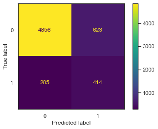


|  | Llamada Exitosa (E) | Llamada Fallida (F) |
| --- | --- | --- |
| Llamada Realizada (R)| 2900 | -440 |
| Llamada No Realizada (NR)| 0 | 200 |

A partir de la matriz de confusión y la matriz de beneficio obtuvimos el beneficio esperado por cliente para la nueva campaña de marketing.


```python
beneficio_total = 4856 * 200 + 414 * 2900 + 623 * (-440)
beneficio_esperado = beneficio_total / 6178
print('El beneficio esperado por cliente para la nueva campaña es de: {:.2f} unidades monetarias'.format(beneficio_esperado))
```

    El beneficio esperado por cliente para la nueva campaña es de: 307.17 unidades monetarias
    

# Conclusiones

Cuando el costo de un acierto o una equivocación no es uniforme entre las clases no hay accuracy que valga y esta era nuestra situación. Incorporar una matriz de costo beneficio nos permitió poder llevar el problema a un terreno más empresarial ya que ponerle un número o valor monetario a cada alternativa para resolver un problema es clave para seleccionar la mejor opción.
